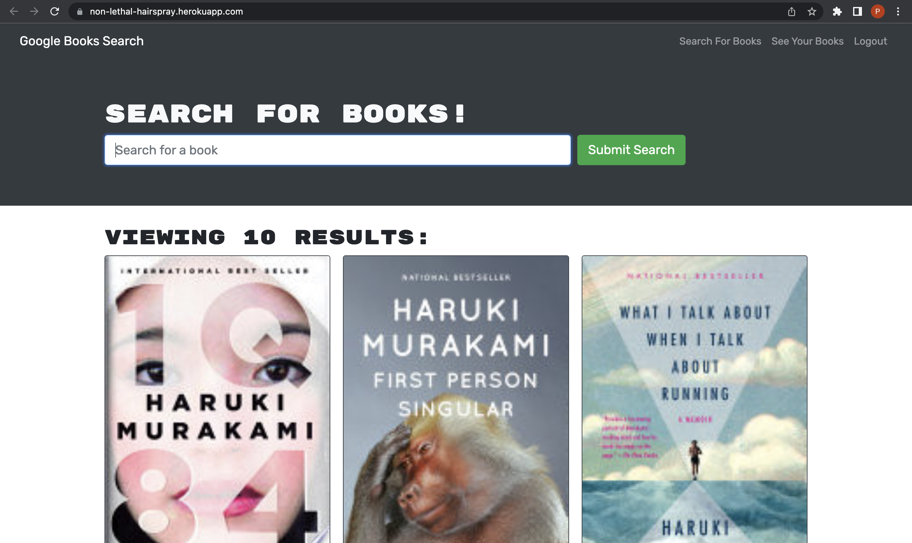
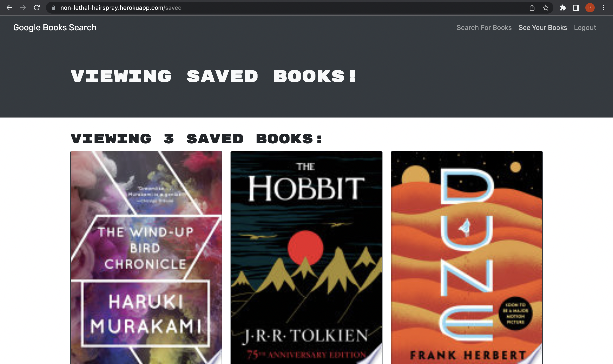

# MERN Book Search Engine

## Description

Book Search Engine is a MERN stack application that allows users to search and save books from Google's Books API. This application uses Apollo Server to make GraphQL requests to its API.

## Usage

You may visit the [deployed application](https://non-lethal-hairspray.herokuapp.com/) hosted on Heroku.

### Questions

If you have any questions about this repository, open an issue or contact me directly at [pcragnol@gmail.com](mailto:pcragnol@gmail.com). You can find more of my work at [pcragnol](https://github.com/pcragnol/).

---
© 2022 Peter Cragnoline

Licensed under [MIT License](LICENSE)
